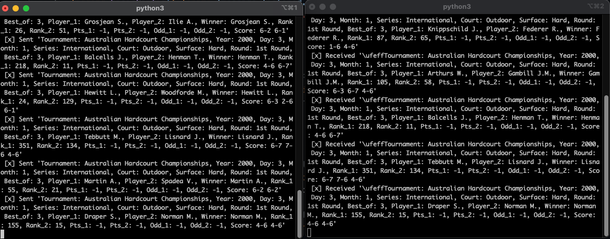

# streaming-03-bonus-joseguzman
Name: Jose Guzman
Date Created: May 16th, 2024 

# Original Data Source
The Data for this project was obtained on [Kaggle](https://www.kaggle.com/datasets/dissfya/atp-tennis-2000-2023daily-pull). 

# What the project does? 
This project demonstrates the use of streaming data from a CSV file using producers and consumers. The send_message.py file will read the CSV file and the listen_for_message.py will recieve the message.  

# Demo of the project. 

